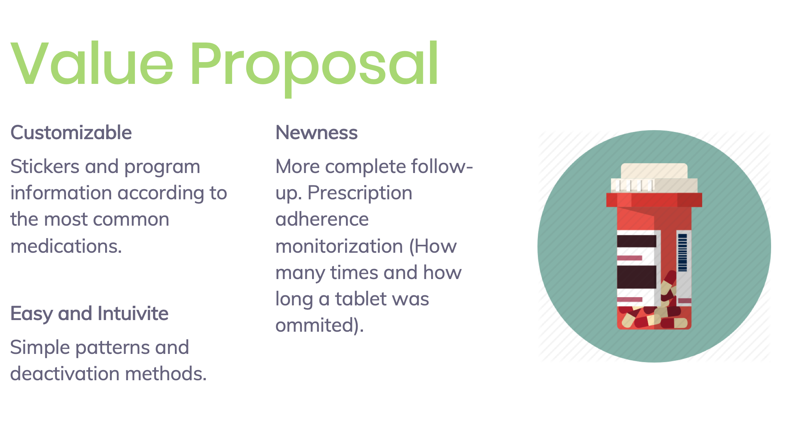
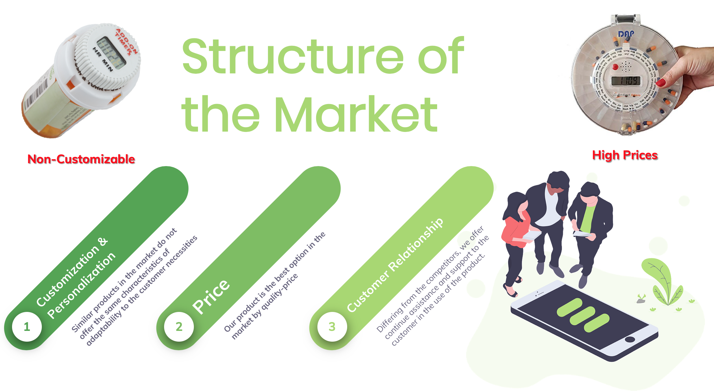

## Welcome to the Mnemosina-Pillbox

# Problem

In México, 26 to 59 % of elders are part of the phenomenon called “Abandonment of treatment”, which consists in interrupting the therapeutic regime.

Take more than two medications at different times and frequencies is hard.

Patients stop taking medication for lack of cognitive support

Economic spillover in the health sector

# Opportunity 

# Prototype

### Support or Contact

 Check out our [documentation](https://help.github.com/categories/github-pages-basics/) or [contact support](https://github.com/contact) and we’ll help you sort it out.
